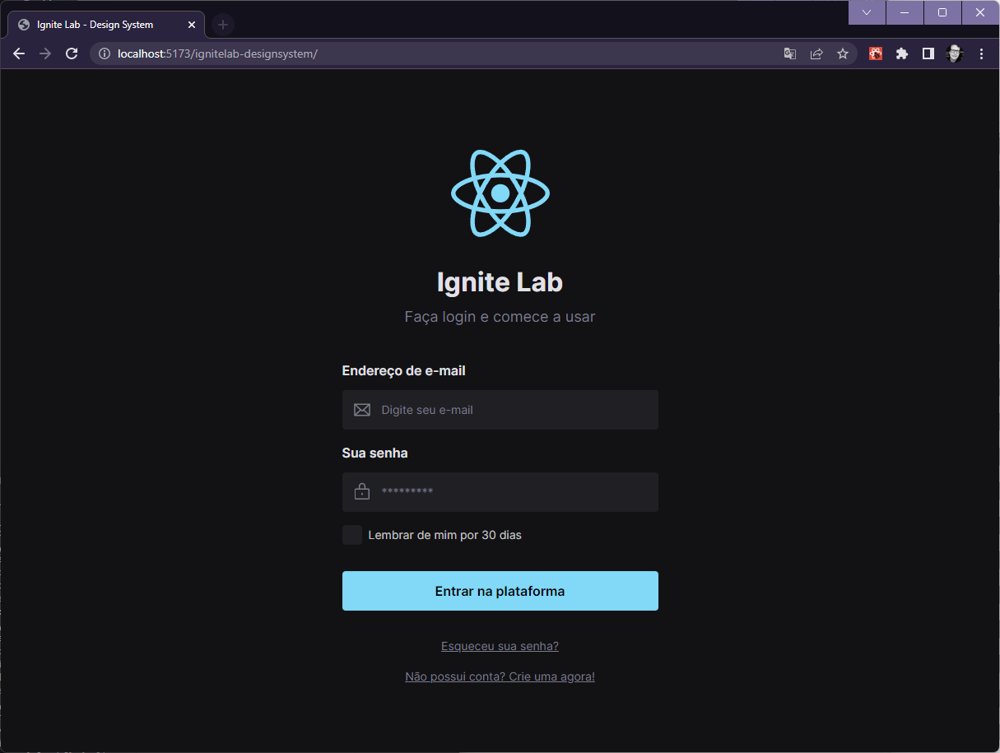

<h1 style="margin-bottom: 40px">Ignite Lab - Design System</h1>

  
Projeto desenvolvido no evento gratuito Ignite Lab - Design System, <a href="https://www.rocketseat.com.br/"> Rocketseat</a>

<a href="https://www.figma.com/file/BcyvG2KrnUzPKJn0gEeFzo/IgniteLab-Design-System?node-id=0%3A1&t=5kTQpxjzTXT1yscK-1">Projeto Figma</a>

  <h2 style="margin-top: 30px">🛠️ Tech Stack</h2>
  

  
Figma

  
Vite + React + Typescript

  
Github Pages React Deploy by <a href="https://github.com/sitek94/vite-deploy-demo">sitek94</a> 

  
ESLint + Prettier + EditorConfig

  
Tailwind CSS

  
Google Fonts

  
Storybook

  <h2 style="margin-top: 30px">🔗 Github Pages</h2>
  

  <a href="https://raszanin.github.io/ignitelab-designsystem/">Design System - Github Pages</a>

  <h2 style="margin-top: 30px">👀 Preview</h2>
  

  

